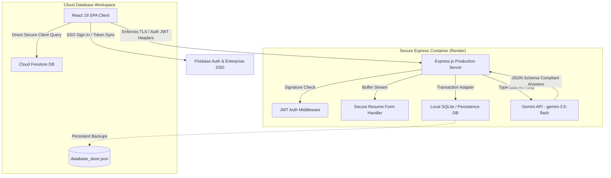

# Enterprise Internal Job Mobility Assistant 🚀
> Premium AI-Powered Talent Mobility, Resume Extraction, and Smart Career Pathing Hub

An enterprise-grade, full-stack HR-tech SaaS application designed to eliminate organizational silos, reduce employee attrition, and unlock internal talent liquidity. Featuring semantic resume parsing, smart matching algorithms, automated up-skilling guides, and predictive corporate demand modeling.

Built using **React (SPA with Vite)** on the frontend and an **Express.js API server** on the backend. Highly integrated with **Google Gemini (`gemini-3.5-flash`)**, and **Firebase (Authentication & Cloud Firestore)**.

---

## 🎨 System Architecture Overview



---

## ⚠️ The Problem Statement

Traditional enterprise mobility programs are bottlenecked by **information asymmetry** and **administrative overhead**:
1. **Hidden Competencies**: Thousands of employees have adjacent, self-taught, or prior-role skills that are omitted from legacy HR systems.
2. **Career Path Opacity**: High-performing individuals leave because they cannot visualize clear transition steps, certification targets, or gaps between their current skills and target internal vacancies.
3. **Reactive HR Sourcing**: Human resource acquisition teams manually screen candidates, failing to leverage the wealth of qualified internal staff across departments.
4. **Skills Deficit Ignorance**: Executives have no real-time dashboard of current technical capabilities, missing insights into systemic skills gaps across teams.

**The Solution**: An autogenetic talent-matching engine that parses user backgrounds, dynamically models up-skilling roadmaps with GenAI, and creates a unified matching workspace.

---

## 🧠 AI Prompt & Cognitive Architecture

The application leverages the ultra-fast, robust `gemini-3.5-flash` model utilizing structured schema parameters (`responseSchema` of `@google/genai`) to guarantee type-safety and robust payload delivery.

### 1. Resume Entity Extraction Pipeline
- **Methodology**: Stream reads uploaded files (using `pdfjs-dist` and `mammoth` for `docx`).
- **Prompt Structure**: Enforces schema translation rules extracting:
  - Technical skills, soft skills, and core domains.
  - Prior job experiences, projects, and educational histories.
  - Standardized department alignment recommendation.
- **Failback Mechanics**: Self-corrects schemas and falls back safely if document streams are corrupted or lack structural sections.

### 2. Conversational Career Coach Engine
- **In-Memory Core Guardrails**: Primed with strict corporate psychology rules. It represents a seasoned professional career advisor focused solely on corporate alignment, certifications, up-skilling, and goal metrics.
- **Structured Gap Analysis**: Automatically scores active portfolios against user-selected jobs, flagging precise missing technical credentials and proposing step-by-step training paths.

---

## 👔 Core Workflows

### 1. Unified Employee Mobility Journey
1. **Authentication**: Sign-on via Google OAuth Single Sign-On (SSO) or corporate credentials.
2. **Onboarding Orientation**: Step-by-step assistant determining workspace goals, work-style options, relocation preferences, and technical fields.
3. **Aesthetic Resume upload**: PDF/DOCX multi-format dropping instantly syncs with the AI parser to update profiles.
4. **Interactive Co-Pilot Chat**: Inquire for career assistance, resume tweaks, or personalized playbooks.
5. **Job Discovery & Matching**: Renders matching scores, skills mismatch breakdowns, and custom certification recommendations.

### 2. HR Admin Administration & Analytics Journey
1. **Access Gate (RBAC)**: Only profiles marked with the `HR_ADMIN` role can access the portal dashboard.
2. **Talent Demand Metrics**: Displays real-time charts including:
   - **Internal Tech Allocations** (AIML vs. Fullstack vs. Data Analytics etc.) using Recharts.
   - **Operational Up-skilling index** indicating aggregate continuous-learning scores.
   - **Match-Rate Quality Distribution** charting internal candidate fitness.
3. **Recruiter Mobility Dashboard**: Administers lists, filters applicant pools by match index, views personal skills profiles, and publishes new job requirements.

---

## 🛠️ Technology Stack & Optimization

- **Client**: `React 18/19` + `Vite` for ultra-lean execution.
- **Lazy Loading**: Route-splitting via React `lazy` and `Suspense` ensures core assets load instantly with minimal initial chunk sizes.
- **Visual Design**: Styled with `Tailwind CSS`, incorporating dark-themed backgrounds, spacious layouts, and custom motion visualizers courtesy of `motion/react`.
- **Server API**: Built on an `Express.js` container using `tsx` in Dev and compiling down to a single, lightning-fast, production-ready CommonJS file (`dist/server.cjs`) with `esbuild`.
- **Relational Stores**: File-backed Local Database Adapter with auto-synchronization and SQLite mount-awareness on cloud platforms.

---

## 📡 API Routing Specifications

All back-end routes are JWT-secured (via the `Authorization: Bearer <TOKEN>` header protocol).

| Method | Endpoint | Description | Expected Payload / Outcome |
| :--- | :--- | :--- | :--- |
| **POST** | `/api/v1/auth/signup` | Registers new systems users. | `{ email, password, name, role, domain }` |
| **POST** | `/api/v1/auth/login` | Authenticates and returns JWT. | `{ email, password }` |
| **POST** | `/api/v1/auth/firebase-google` | Validates Google Auth claims. | `{ email, uid, name, avatar, role }` |
| **GET** | `/api/v1/profile` | Yields authenticated profile. | Returns user entity & employee profile. |
| **PUT** | `/api/v1/profile` | Syncs profile alterations. | `{ bio, interests, relocation, workStyle }` |
| **POST** | `/api/v1/resume/upload` | Parses file binary over stream. | Multi-part form stream; returns parsed profile. |
| **POST** | `/api/v1/coach/chat` | AI co-pilot conversational prompt. | `{ message, history: [...] }` |
| **GET** | `/api/v1/jobs` | Queries matching opportunities. | Yields active listings with affinity metrics. |
| **POST** | `/api/v1/hr/jobs` | Publishes new corporate postings. | `{ title, department, location, description }` |
| **GET** | `/api/v1/hr/analytics` | High-fidelity executive data. | Aggregates role charts, fit score distributions. |

---

## ⚙️ Environment Configuration

Copy `.env.example` in your working directory and populate variables:

```env
# =========================================================================
#                       PRODUCTION DEPLOYMENT ENVIRONMENT
# =========================================================================
PORT=3000
NODE_ENV=production
JWT_SECRET=use_a_strong_alphanumeric_secret_phrase

# Google Gemini Credentials
GEMINI_API_KEY=AIzaSy_your_gemini_prod_key

# SQLite Mount Selection (Default is root directory)
DB_PATH=./database_store.json

# Resend API Integrator Key (Optional, for Enterprise Logs)
RESEND_API_KEY=re_your_resend_integration_token
```

---

## 🚀 Step-by-Step Cloud Deployment Guide

### Deployment A: Collaborative Full-Stack (Default Recommended)
Render is fully configured via `render.yaml` inside the repository.
1. Create a **Web Service** on Render connected to your GitHub Repo.
2. Select **Docker** or **Node** environment. Set build and start parameters:
   - **Build Command**: `npm install && npm run build`
   - **Start Command**: `npm run start` (Starts compiled `dist/server.cjs`)
3. Mount a disk space size `1 GB` on path `/data` to preserve your relational SQLite store.
4. Set environment keys for `GEMINI_API_KEY`, `JWT_SECRET`, and `DB_PATH=/data/database_store.json`.

### Deployment B: Divided Deployment (Decoupled Microservices)

#### Frontend (Vercel Integration)
1. Import target repository into **Vercel**.
2. Customize configuration details:
   - Framework Preset: **Vite**
   - Output Directory: **dist**
   - Environment variables: Inject your Firebase Web App credentials.
3. Vercel utilizes the client-side proxy rules in `/vercel.json` to safely route API requests over to your backend.

#### Backend API (Render Container)
1. Deploy as an Express Web Service.
2. Provide standard environment keys matching credentials.

#### Firebase Security Configuration (ABAC Rules)
To ensure strict security and prevent data leaks, deploy the provided `firestore.rules` containing role-based logic:
```bash
# Register Firebase CLI and select deployment parameters
npm install -g firebase-tools
firebase login
firebase deploy --only firestore
```

#### Google Identity Setup (Third-Party Oauth Scope)
1. Navigate to **Google Cloud Console > Credentials > OAuth 2.0 Client IDs**.
2. Under "Authorized Javascript Origins", specify your frontend domain: `https://your-custom-app.vercel.app`
3. Under "Authorized Redirect URIs", map the Firebase authentication gateway callback: `https://your-project-id.firebaseapp.com/__/auth/handler`

---

## 📸 Component Screenshots Placeholders

Below are primary layouts of our application:

### 🌟 1. Core Employee Hub Dashboard

*Highlights high-contrast layout, up-skilling telemetry metrics, and custom skills alignment.*

### 🧠 2. AI Career Co-Pilot Chat

*Visualizing interactive skills gap analysis and dynamic certification playbook creation.*

### 📊 3. HR Admin Talent Insights

*Renders active talent distributions, internal matching quality curves, and talent maps.*

---

## 📝 License
Proprietary software licensed and designated exclusively for enterprise Human Capital strategy deployment.
